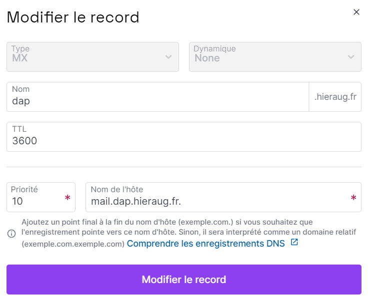
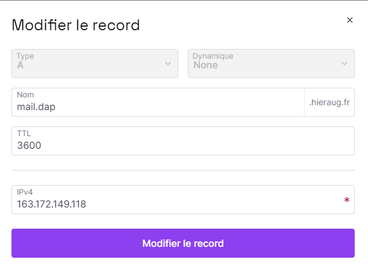

**Setting up DNS records for your mail server involves configuring several types of records: MX, A, SPF, DKIM, and DMARC. These records are crucial for the proper operation and security of your email services. The exact process can vary depending on your DNS provider, but here's a general guide on how to set them up:**

## Menu
- [Add these Records in your DNS](#add-these-records-in-your-dns)
  - [MX Record](#mx-record)
  - [A Record for Mail Server](#a-record-for-mail-server)
  - [SPF Record](#spf-record)
  - [DKIM Record](#dkim-record)
  - [DMARC Record](#dmarc-record)
- [To configure a mail server using a subdomain](#to-configure-a-mail-server-using-a-subdomain)
    - [Steps to follow:](#steps-to-follow)

# Add these Records in your DNS

**replace `example.com` by your domain name**.


MX Record
---
An MX (Mail Exchange) record directs email to a mail server. It tells other email servers where to send emails when they are addressed to your domain (e.g, `example.com`). 

Create MX Record:

Type: MX
Host/Name: Usually @ or your domain name, `example.com`.
Value: Your mail server's hostname, `mail.example.com`.
Priority: Set a priority (lower numbers have higher priority). For a single mail server, 10 is a common choice.

A Record for Mail Server
---
An A record maps a domain name to its corresponding IP address.

Create A Record for Mail Server:

Type: A
Host/Name: mail (for mail.example.com).
Value: IP address of your Docker host (your vm ip address).


SPF Record
---
An SPF (Sender Policy Framework) record specifies which mail servers are permitted to send email on behalf of your domain.

Create SPF Record:

Type: TXT
Host/Name: @ or your domain name.
Value: An SPF rule, such as v=spf1 mx -all (allows mail only from your MX server).

```"v=spf1 ip4:<your-ip> a mx ~all"```

DKIM Record
---
DKIM (DomainKeys Identified Mail) helps prevent email spoofing.

Generate DKIM Key: This is usually done via your mail server. docker-mailserver has a setup.sh script that can generate DKIM keys.

Create DKIM Record:

Type: TXT
Host/Name: Often something like default._domainkey (but depends on your DKIM setup).
Value: The DKIM key generated by your mail server.

with DKIM key generate by mailserver : it will based on hostname configured early.
in this case `mail.example.com`, it will generate mail.txt and mail.private.

so in your DNS zone, for Host/Name : set `mail._domainkey`

```
# generate dkim keys, it will generate keys on /tmp/docker-mailserver/opendkim/keys/example.com/ and will be binded to docker-data/dms/config/opendkim/keys/example.com
# it generates mail.private and mail.txt
./setup.sh config dkim
```

Your DNS record file (eg: mail.txt) should look similar to this:

```
mail._domainkey IN TXT ( "v=DKIM1; k=rsa; "
"p=MIIBIjANBgkqhkiG9w0BAQEFAAOCAQ8AMIIBCgKCAQEAqQMMqhb1S52Rg7VFS3EC6JQIMxNDdiBmOKZvY5fiVtD3Z+yd9ZV+V8e4IARVoMXWcJWSR6xkloitzfrRtJRwOYvmrcgugOalkmM0V4Gy/2aXeamuiBuUc4esDQEI3egmtAsHcVY1XCoYfs+9VqoHEq3vdr3UQ8zP/l+FP5UfcaJFCK/ZllqcO2P1GjIDVSHLdPpRHbMP/tU1a9mNZ"
"5QMZBJ/JuJK/s+2bp8gpxKn8rh1akSQjlynlV9NI+7J3CC7CUf3bGvoXIrb37C/lpJehS39KNtcGdaRufKauSfqx/7SxA0zyZC+r13f7ASbMaQFzm+/RRusTqozY/p/MsWx8QIDAQAB"
)
```

Take the content between ( ... ), and combine all the quote wrapped content and remove the double-quotes including the white-space between them. That is your TXT record value, the above example would become this:

```
v=DKIM1; k=rsa; p=MIIBIjANBgkqhkiG9w0BAQEFAAOCAQ8AMIIBCgKCAQEAqQMMqhb1S52Rg7VFS3EC6JQIMxNDdiBmOKZvY5fiVtD3Z+yd9ZV+V8e4IARVoMXWcJWSR6xkloitzfrRtJRwOYvmrcgugOalkmM0V4Gy/2aXeamuiBuUc4esDQEI3egmtAsHcVY1XCoYfs+9VqoHEq3vdr3UQ8zP/l+FP5UfcaJFCK/ZllqcO2P1GjIDVSHLdPpRHbMP/tU1a9mNZ5QMZBJ/JuJK/s+2bp8gpxKn8rh1akSQjlynlV9NI+7J3CC7CUf3bGvoXIrb37C/lpJehS39KNtcGdaRufKauSfqx/7SxA0zyZC+r13f7ASbMaQFzm+/RRusTqozY/p/MsWx8QIDAQAB
``` 

```
# restart docker
docker compose down && docker compose up -d
```

To test that your new DKIM record is correct, query it with the dig command. The TXT value response should be a single line split into multiple parts wrapped in double-quotes:
```
$ dig +short TXT dkim-rsa._domainkey.example.com
"v=DKIM1; k=rsa; p=MIIBIjANBgkqhkiG9w0BAQEFAAOCAQ8AMIIBCgKCAQEAqQMMqhb1S52Rg7VFS3EC6JQIMxNDdiBmOKZvY5fiVtD3Z+yd9ZV+V8e4IARVoMXWcJWSR6xkloitzfrRtJRwOYvmrcgugOalkmM0V4Gy/2aXeamuiBuUc4esDQEI3egmtAsHcVY1XCoYfs+9VqoHEq3vdr3UQ8zP/l+FP5UfcaJFCK/ZllqcO2P1GjIDVSHLdPpRHbMP/tU1a9mNZ5QMZBJ/JuJK/s+2bp8gpxKn8rh1akSQjlynlV9NI+7J3CC7CUf3bGvoXIrb37C/lpJehS39" "KNtcGdaRufKauSfqx/7SxA0zyZC+r13f7ASbMaQFzm+/RRusTqozY/p/MsWx8QIDAQAB"
```

DMARC Record
---
DMARC (Domain-based Message Authentication, Reporting, and Conformance) specifies how mail servers should handle messages from your domain that do not have valid SPF and DKIM records.

Create DMARC Record:

Type: TXT
Host/Name: _dmarc
Value: A DMARC rule, like v=DMARC1; p=none; rua=mailto:postmaster@example.com (this is a basic policy for monitoring; adjust as needed).

---

# To configure a mail server using a subdomain

The same process will be applied to subdomain. Using a separate subdomain for your mail server (like `mail.subdomain.example.com`) and setting up your email addresses with the main domain (@subdomain.example.com) is a common and effective setup. This allows for clear separation between your mail server infrastructure and your main domain
the mail server is at `mail.subdomain.example.com` and the main domain for email addresses is `subdomain.example.com`, you can follow these steps:

Mail Server Setup: Install and configure your mail server (like Docker Mailserver) on a server designated for `mail.subdomain.example.com`.

DNS Configuration:

MX Record: Create an MX record for `subdomain.example.com` that points to `mail.subdomain.example.com`.
A Record: Ensure an A record exists for `mail.subdomain.example.com` pointing to the IP address of your mail server.
Email Addresses: Create email addresses using the `subdomain.example.com` domain (e.g., user@subdomain.example.com).

Server Configuration: Configure your mail server to handle emails for `subdomain.example.com`, and ensure it recognizes `mail.subdomain.example.com` as the mail server address.

By following these steps, you establish a mail server on a subdomain while maintaining a cohesive email identity under your primary subdomain.

### Steps to follow:

Exemple your domain is `hieraug.fr`, and you want to setup a sub domain with `dap`.</br>
1. first, create a sub domain `dap` with type 'MX' (recieve from external other mail servers).


</br>

2.Secondly, create another subdomain `mail.dap` with type 'A' that will point to your instance and serve emails based on `dap` as a recognized MX server.
</br>

